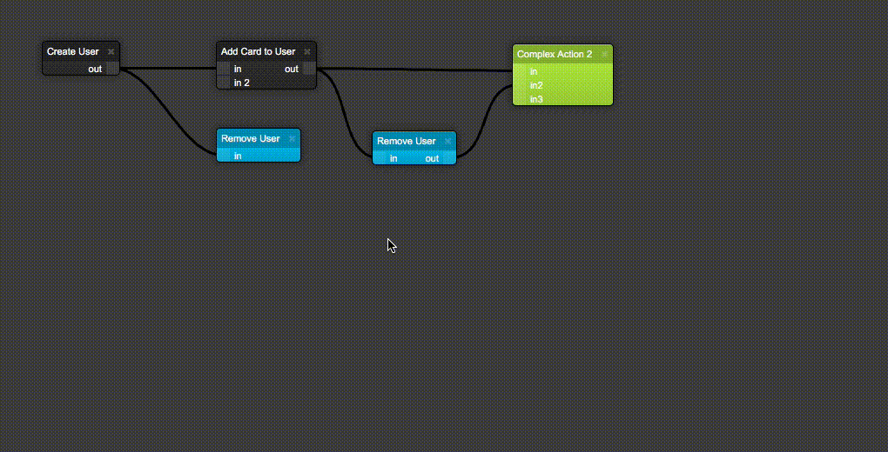

# STORM React Diagrams

A super simple, no-nonsense diagramming library written in React that just works.

[](https://gitter.im/projectstorm/react-diagrams?utm_source=badge&utm_medium=badge&utm_campaign=pr-badge&utm_content=badge)
[](https://npmjs.org/package/storm-react-diagrams)


## Introduction

A no-nonsense diagramming library written entirely in React with the help of Lodash. It aims to be:

* Simple, and void of any fuss/complications when implementing it into your own application
* Customizable without having to hack the core (adapters/factories etc..)
* Simple to operate and understand without sugar and magic
* Fast and optimized to handle large diagrams with hundreds of nodes/links
* Super easy to use, and should work as you expect it to

## How to install

```
npm install storm-react-diagrams
```
or
```
yarn add storm-react-diagrams
```

* Its only dependency is Lodash and obviously React so it will install that too.

#### How to see the examples

simply navigate to the __demos__ directory and load up the corresponding index.html

To see how to create your own nodes like the one below, take a look at __demo3__:


#### How to build

Simply run ```webpack``` in the root directory and it will spit out the transpiled code and typescript definitions
into the dist directory as a single file. We use webpack for this because TSC cannot compile a single UMD file (TSC can currently
only output multiple UMD files).


## How does it work

The library uses a Model Graph to represent the virtual diagram and then renders the diagram using
2 layers:
* Node Layer -> which is responsible for rendering nodes as HTML components
* Link Layer -> which renders the links as SVG paths

Each node and link is fed into a factory that then generates the corresponding node or link react widget.
Therefore, to create custom nodes and links, register your own factories that return your own widgets.

As long as a node contains at least one port and the corresponding NodeWidget contains at least one PortWidget,
a link can be connected to it.

## Events
 - entityRemoved (entity)
 - selectionChanged (entity, isSelected:Boolean)
 - nodeFactoriesUpdated
 - linkFactoriesUpdated
 - controlsUpdated
 - linksUpdated (entity, isAdded:Boolean)
 - nodesUpdated (entity, isAdded:Boolean)
 
 ### Example of usage
 ```ecmascript 6
let model = new SRD.DiagramModel();
let node1 = new SRD.DefaultNodeModel("default","rgb(0,192,255)");
node1.addListener({
      entityRemoved: (node) => {
        console.log('Removed', node.id)
      },
      selectionChanged: (node, isSelected) => {
        console.log(isSelected?'Selected':'Unselected', node)
      }
    });
model.addListener({
      linksUpdated:(entity, isAdded) => {
        console.log(isAdded?'added':'removed', entity)
      },
      nodesUpdated: (entity, isAdded) => {
        console.log(isAdded?'added':'removed', entity)
      }
    });
```


## Questions

#### Why didn’t I render the nodes as SVG's?

Because its vastly better to render nodes as standard HTML so that we can embed input controls and not have
to deal with the complexities of trying to get SVG to work like we want it to. I also created this primarily to embed into
enterprise applications where the nodes themselves are highly interactive with buttons and other controls that cave when I try to use SVG.

#### Why Typescript?

Because it can transpile into any level of ECMA Script, and the library got really complicated, so I ported it to Typescript
to accommodate the heavy architectural changes I was starting to make. <3 Type Script

#### Why is there no JSX?

Because most of the library is 95% all logic anyway, and I construct very complex DOM elements with many dynamic properties. JSX
Would just get in the way, and I personally hate JSX for a multitude of reasons anyway.

#### How do I make my own elements?

Take a look at the __defaults__ directory, with specific attention to the __DefaultNodeWidget__

#### How do I use the library?

Take a look at the demo folders, they have simple and complex examples of the complete usage.

## Usage Demo and Guide

This is a demo of the interaction taken directly from the test folder.



#### Key commands

__del key__ will remove anything selected including links

__shift and drag__ will trigger a multi selection box

__shift and select nodes/links/points__ will select multiple nodes

__drag canvas__ will drag the complete diagram

__mouse wheel__ will zoom in or out the entire diagram

__click link and drag__ will create a new link anchor/point that you can then drag around

__click node-port and drag__ will create a new link that is anchored to the port, allowing you
to drag the link to another connecting port
