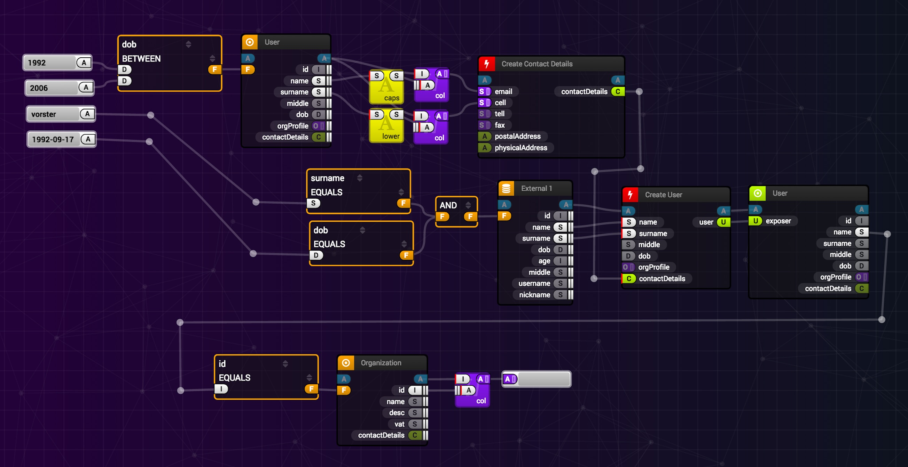

# STORM React Diagrams __6__ [beta] •

 [](https://gitter.im/projectstorm/react-diagrams?utm_source=badge&utm_medium=badge&utm_campaign=pr-badge&utm_content=badge)  [](https://npmjs.org/package/@projectstorm/react-diagrams)  [](http://packagequality.com/#?package=storm-react-diagrams)  [](https://circleci.com/gh/projectstorm/react-diagrams/tree/master) [](https://lerna.js.org/)


[pssst! Looking for the old version 5?](https://github.com/projectstorm/react-diagrams/tree/v5.3.2)

---

**DEMO**: [http://projectstorm.cloud/react-diagrams](http://projectstorm.cloud/react-diagrams)

**(SOME) DOCS:** [https://projectstorm.gitbooks.io/react-diagrams](https://projectstorm.gitbooks.io/react-diagrams)


Example implementation using custom models: (Dylan's personal code)



Get started with the default models right out of the box:


## What

A flow & process orientated diagramming library inspired by __Blender__, __Labview__ and __Unreal engine__.

* __Modern Codebase__ written entirely in Typescript and React, the library makes use of powerful generics, advanced software engineering principles and is broken up into multiple modules.
* __Hackable and extensible__ the entire library including its core can be extended, rewired and re-assembled into fundamentally different software to suit your own software needs.
* __HTML nodes as a first class citizen__ the library was originally written to represent advanced dynamic nodes, that are difficult to represent as SVG's due to complex input requirements ux requirements.
* __Designed for process__ the library is aimed for software engineers that want to rewire their programs at runtime, and that want to make their software more dynamic.
* __Fast diagram editing__ the defaults provided give the heighest priority to editing diagrams as fast as possible.

## Installing

For all the bells and whistles:

    yarn add @projectstorm/react-diagrams

This includes all the packages listed below (and works (mostly and conceptually) like it used to in version 5.0)

### A more modular approach

This library now has a more modular design and you can import just the core (contains no default factories or routing)

    yarn add @projectstorm/react-diagrams-core

this is built ontop of the evolving __react-canvas-core__ library

```
yarn add @projectstorm/react-diagrams-core
```

which makes use of

```
yarn add @projectstorm/react-geometry
```

and of course, you can add some extras:

    yarn add @projectstorm/react-diagrams-defaults
    yarn add @projectstorm/react-diagrams-routing

## How to use

Take a look at the [demos](packages/diagrams-demo-gallery)

__or__

Take a look at the [demo project](packages/diagrams-demo-project) which contains an example for ES6 as well as Typescript

## Run the demos

After running `yarn install` you must then run:  `cd packages/diagrams-demo-gallery && yarn run start`

## Building from source

Simply run `yarn build` in the root directory \(or `NODE_ENV=production yarn build` if you want a production build\) and it will spit out the transpiled code and typescript definitions into the dist directory as a single file.
We use webpack for this because TSC cannot compile a single UMD file \(TSC can currently only output multiple UMD files\).

## [Checkout the docs](https://projectstorm.gitbooks.io/react-diagrams)


