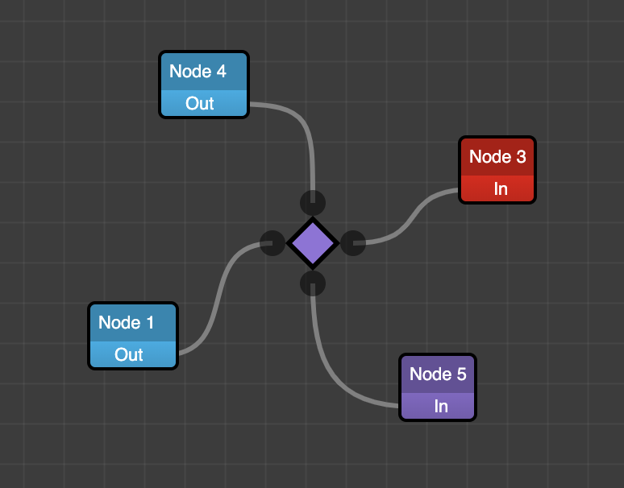

# Ports

Ports allow links to connect to your nodes. Each port that is rendered in a node must also have a corresponding PortModel in the corresponding NodeModel (as is the case with essentially all of the models and widgets in this library).

## Custom port widgets

If you want to create a custom port that looks entirely different (much like in the image below), then you simply need to create your own widget and wrap it in a `PortWidget`:

```jsx
<PortWidget
    port={this.props.node.getPort("in"}
    engine={this.props.engine} >
    <div
        style={{
            width: 40,
            height: 40,
            background: 'orange'
        }}
    />
</PortWidget>
```

Obviously, you can create the React widgets in any way you like. Whether you use __Emotion__, __BEM__ or plain old __CSS__, the only important thing is that your custom port is wrapped inside a `PortWidget`

## Specifying alignment

When links enter ports, depending on the alignment specified, they can help the links render differently. Take the following example:



In the above example, the 4 ports on the diamond node model are setup with different alignment:

```typescript
this.addPort(new DiamondPortModel(PortModelAlignment.TOP));
this.addPort(new DiamondPortModel(PortModelAlignment.LEFT));
this.addPort(new DiamondPortModel(PortModelAlignment.BOTTOM));
this.addPort(new DiamondPortModel(PortModelAlignment.RIGHT));
```

Each of the custom `DiamondPortModel` models forwards this through to the base `PortModel` class:

```typescript
export class DiamondPortModel extends PortModel {
    ...
	constructor(alignment: PortModelAlignment) {
		super({
			type: 'diamond',
			name: alignment,
			alignment: alignment // <-- here
		});
    }
    ...
}
```

## Specifying if a link can be connected

A port is directly responsible for specifying if a link is allowed to connect to it. When you drag an un-connected link end-point to a target port, the target port lets the link know if it is allowed to connect.

```typescript
class PortModel{
    ...
    canLinkToPort(port: PortModel): boolean;
}
```

In the above definition, the port argument is the source port that the incoming link is connected to. By default, the method returns true, but you can extend this and overide this method to do more advanced checks.

The `DefaultPortModel` provided in the defaults package, makes use of this principle to only allow `Out` ports to connect to `In` ports:

```typescript
class DefaultPortModel extends PortModel{
    ...
    canLinkToPort(port: PortModel): boolean {
		if (port instanceof DefaultPortModel) {
			return this.options.in !== port.getOptions().in;
		}
		return true;
	}
}
```

## Specifying what type of link is generated from a port

When a user drags on a port to generate a link, the port is also responsible for specifying
what link is created. This happens through the `createLinkModel()` method:

```typescript
class DefaultPortModel extends PortModel{
    ...
    createLinkModel(): LinkModel{
        return new DefaultLinkModel(); // <-- here we generate a DefaultLinkModel
    }
}
```